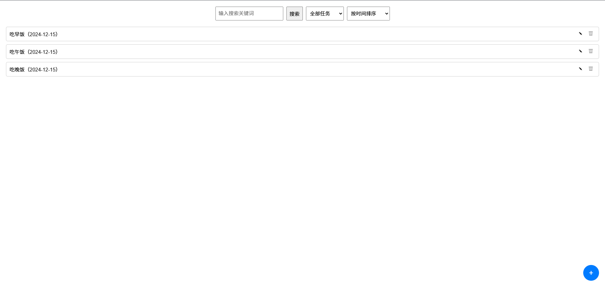

"Innovative Practice" course assignment
“创新实践”课程作业

使用Node.js做的TodoList小项目，借此完整过一遍开发流程

主页面


---
### **TODO 应用 API 文档**

#### **1. 创建任务**

- **请求类型**：`POST`
- **请求路径**：`/api/tasks`
- **请求参数**：
    - `title`（必填）：任务标题（字符串，最大长度 255）
    - `description`（可选）：任务描述（字符串）
    - `dueDate`（可选）：任务截止日期（ISO 8601 格式字符串，如：`2024-12-25T12:00:00Z`）
    - `status`（可选）：任务状态，默认值为 `pending`（`pending` 或 `completed`）
    - `priority`（可选）：任务优先级（字符串，可选值：`low`，`medium`，`high`）
- **请求示例**：

```json
{
  "title": "完成TODO应用API文档",
  "description": "编写详细的API文档，包含每个功能的请求和响应示例。",
  "dueDate": "2024-12-10T12:00:00Z",
  "priority": "high"
}
```

- 响应：

    - **成功响应**：

        - 状态码：`201 Created`
        - 响应体：

      ```json
      {
        "id": 1,
        "title": "完成TODO应用API文档",
        "description": "编写详细的API文档，包含每个功能的请求和响应示例。",
        "dueDate": "2024-12-10T12:00:00Z",
        "status": "pending",
        "priority": "high",
        "createdAt": "2024-11-30T10:00:00Z",
        "updatedAt": "2024-11-30T10:00:00Z"
      }
      ```

    - **失败响应**：

        - 状态码：`400 Bad Request`
        - 响应体：

      ```json
      {
        "error": "Title is required"
      }
      ```

------

#### **2. 查看任务**

- **请求类型**：`GET`
- **请求路径**：`/api/tasks`
- **请求参数**：
    - `status`（可选）：任务状态过滤选项，值为 `all`（所有任务），`pending`（未完成任务），`completed`（已完成任务）。默认值为 `all`。
    - `priority`（可选）：任务优先级过滤选项，值为 `low`、`medium`、`high`，支持多选。
- **请求示例**：

```http
GET /api/tasks?status=all&priority=high
```

- 响应：

    - **成功响应**：

        - 状态码：`200 OK`
        - 响应体：

      ```json
      [
        {
          "id": 1,
          "title": "完成TODO应用API文档",
          "description": "编写详细的API文档，包含每个功能的请求和响应示例。",
          "dueDate": "2024-12-10T12:00:00Z",
          "status": "pending",
          "priority": "high",
          "createdAt": "2024-11-30T10:00:00Z",
          "updatedAt": "2024-11-30T10:00:00Z"
        }
      ]
      ```

    - **失败响应**：

        - 状态码：`400 Bad Request`
        - 响应体：

      ```json
      {
        "error": "Invalid filter options"
      }
      ```

------

#### **3. 编辑任务**

- **请求类型**：`PUT`
- **请求路径**：`/api/tasks/{id}`
- **请求参数**：
    - `title`（可选）：任务标题
    - `description`（可选）：任务描述
    - `dueDate`（可选）：任务截止日期
    - `status`（可选）：任务状态（`pending` 或 `completed`）
    - `priority`（可选）：任务优先级（`low`、`medium`、`high`）
- **请求示例**：

```json
{
  "title": "更新TODO应用API文档",
  "description": "更新API文档，包含最新的功能描述。",
  "dueDate": "2024-12-12T12:00:00Z",
  "priority": "medium"
}
```

- 响应：

    - **成功响应**：

        - 状态码：`200 OK`
        - 响应体：

      ```json
      {
        "id": 1,
        "title": "更新TODO应用API文档",
        "description": "更新API文档，包含最新的功能描述。",
        "dueDate": "2024-12-12T12:00:00Z",
        "status": "pending",
        "priority": "medium",
        "createdAt": "2024-11-30T10:00:00Z",
        "updatedAt": "2024-12-01T10:00:00Z"
      }
      ```

    - **失败响应**：

        - 状态码：`400 Bad Request`
        - 响应体：

      ```json
      {
        "error": "Invalid task ID"
      }
      ```

------

#### **4. 删除任务**

- **请求类型**：`DELETE`
- **请求路径**：`/api/tasks/{id}`
- **请求参数**：无（通过 URL 提供任务的 `id`）
- **请求示例**：

```http
DELETE /api/tasks/1
```

- 响应：

    - **成功响应**：

        - 状态码：`204 No Content`
        - 响应体：无

    - **失败响应**：

        - 状态码：`404 Not Found`
        - 响应体：

      ```json
      {
        "error": "Task not found"
      }
      ```

------

#### **5. 标记任务完成/未完成**

- **请求类型**：`PATCH`
- **请求路径**：`/api/tasks/{id}/status`
- **请求参数**：
    - `status`（必填）：任务的新状态，值为 `pending` 或 `completed`。
- **请求示例**：

```json
{
  "status": "completed"
}
```

- 响应：

    - **成功响应**：

        - 状态码：`204 No Content`
        - 响应体：无

    - **失败响应**：

        - 状态码：`400 Bad Request`
        - 响应体：

      ```json
      {
        "error": "Invalid status value"
      }
      ```


